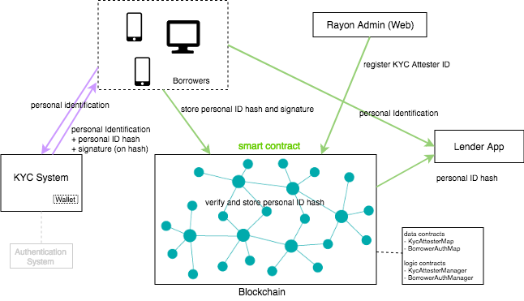
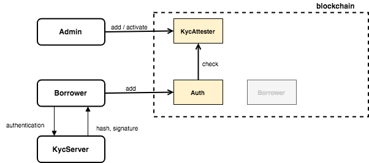

# RayonProtocol KYC Contracts

This is a kyc contract project of RayonProtocol

## About
### Architecture
 - The Rayon KYC System server signs provided identity data
 - KYC Management smart contract verifies and registers KYC attestation data on the blockchain.
 - System Architecture



 - Contracts




## Getting Started

### Installing

- clone the repository to your local drive

```
$ git clone https://github.com/rayonprotocol/rayonprotocol-contract-kyc.git
```

- install truffle

```
npm install -g truffle
```

- install [ganache](http://truffleframework.com/ganache/) for use of local development node

- install node_module

```
$ npm install 
```

#### Deployment

- deploy smart contracts

```
$ truffle deploy
```

#### Test

- execute test scripts

```
$ truffle test

```

## Built With
* [Truffle](https://truffleframework.com/) - Ethereum Smart Contract Framework
* [Solidity](https://github.com/ethereum/solidity) - Used to develop the Reverse Inquiry smart contracts
* [Node.js](https://nodejs.org/en/) - Server application framework for KYC System

## Acknowledgments
